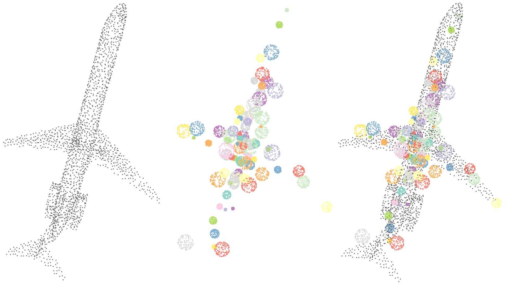

# Specialized Point Set Embedding

## Point Set Embedding

Think of it as point set tokenization, like word tokenization, you transform an unordered point set X into an ordered feature for learning.

The embedding method should meet one condition, that information is intact given large enough embedding dimension.

Normally, it is achieved with a pointwise transformation f followed by pooling: output channel c = pool(f_c(x) for x in X). For example, in PointNet, f is modelled by an MLP, pool is max-pooling.

Under max-pooling, f can easily satisfy the information preservation condition (just need 3 more conditions):

1. f_c(x) has a unique global maximum attained at p_c.
2. With certain parameterizations, p_c can reach anywhere within the distribution space of X.
3. f_c(x) decreases as ||x-p_c|| increases.

It should be evident that when embedding dimension is sufficiently large and p_c's are well scattered, any point in the original set can be detected.

## Specialization

If we only consider raw inputs here, like coordinates instead of latent features, then heavy MLPs are overkill, and specialization is the way to go.

The simplest one is a ball: f_c(x) = -||x-p_c||. This only models radius r, we can enhance expressivity by including the polar angle θ and azimuth φ of x relative to p_c: f_c(x) = g_c(θ, φ) * r.

One can model g_c by spherical harmonics, just clamp it to be negative. But spherical harmonics is a bit complex, slow, and non-intuitive for parameter initialization.

Another intuitive solution is the ellipsoid: f_c(x) = -||W_c * (x-p_c)||, where W_c is a transformation matrix determined by scaling and rotation factors. It's easy to compute and performs well in practice.

This can be easily extended to other inputs. Just meet the 3 conditions. In DeLA v2, I use ellipsoid for coordinates and ball for other inputs. It's essentially ellipsoid, just with some elements in W_c removed.

## Visualization

Each ball is an output feature, indicating that no point of the original set exists within, and one point exists on the boundary.

The space is thus defined.

## Efficiency

SPSE operates in-place and consumes no extra memory. SPSE works on-chip and is thus fast.

Replacing MLP with SPSE in DeLA for spatial encoding, speed increases to around 1.5x and training memory decreases to 70%, almost as if spatial encoding is a no-op.